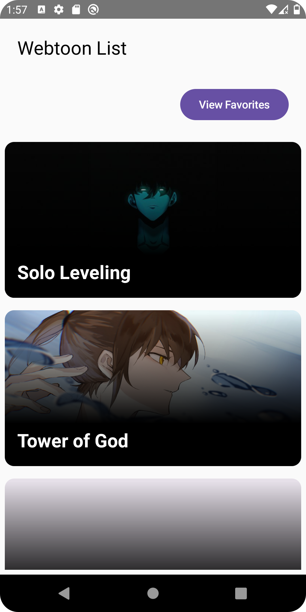

# Mangatoon 📖

A simple and elegant Android application for browsing a library of manga, adding titles to your favorites, and viewing your personalized collection.

## 🌟 Features

* **Browse Manga:** View a list of available manga titles.
* **Favorites:** Add and remove manga from your personal favorites list.
* **View Favorites:** A dedicated screen to view all your favorited manga.
* **Simple UI:** A clean and intuitive user interface for a seamless reading experience.

## 📸 Screenshots

| Home Screen | Manga Screen |Favorites Screen |
| :---: | :---: | :---: |
|  |  | |


## 🛠️ Technologies Used

This project is built with a modern Android development tech stack.

* **[TODO: Confirm and add your technologies. Here are some likely candidates:]**
* **Language:** [Kotlin](https://kotlinlang.org/)
* **UI:** [Jetpack Compose](https://developer.android.com/jetpack/compose)
* **Architecture:** [MVVM (Model-View-ViewModel)](https://developer.android.com/jetpack/guide/ui-layer#viewmodel)
* **Asynchronous Programming:** [Kotlin Coroutines](https://kotlinlang.org/docs/coroutines-overview.html)
* **Dependency Injection:** [Hilt](https://developer.android.com/training/dependency-injection/hilt-android)
* **Networking:** [Retrofit](https://square.github.io/retrofit/)
* **Local Storage:** [Room](https://developer.android.com/training/data-storage/room)
* **Navigation:** [Jetpack Navigation Component](https://developer.android.com/guide/navigation)

## 🚀 Getting Started

To get a local copy up and running, follow these simple steps.

### Prerequisites

* Android Studio Bumblebee (2021.1.1) or later
* Git

### Installation

1.  **Clone the repository:**
    ```sh
    git clone [https://github.com/devansssss/Mangatoon.git](https://github.com/devansssss/Mangatoon.git)
    ```
2.  **Open the project in Android Studio.**
3.  **Let Android Studio handle the Gradle sync.**
4.  **Run the app on an emulator or a physical device.**

## 🤝 Contributing

Contributions are what make the open-source community such an amazing place to learn, inspire, and create. Any contributions you make are **greatly appreciated**.

If you have a suggestion that would make this better, please fork the repo and create a pull request. You can also simply open an issue with the tag "enhancement".

1.  Fork the Project
2.  Create your Feature Branch (`git checkout -b feature/AmazingFeature`)
3.  Commit your Changes (`git commit -m 'Add some AmazingFeature'`)
4.  Push to the Branch (`git push origin feature/AmazingFeature`)
5.  Open a Pull Request
